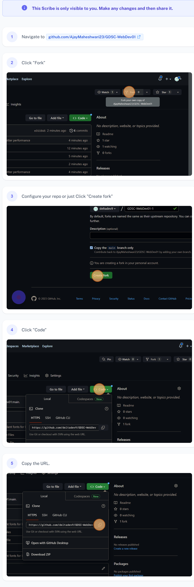

# **Developer Students Club** Basic JS Tutorial

## How to get started

- [Fork](https://docs.github.com/en/get-started/quickstart/fork-a-repo) the repo



- [Clone](https://docs.github.com/en/repositories/creating-and-managing-repositories/cloning-a-repository) your fork locally

```bash
git clone <url you just copied>
```

- Start coding!

## For further reading

- [JavaScript DOM](https://www.w3schools.com/js/js_htmldom.asp)
- [DOM Events](https://www.w3schools.com/js/js_htmldom_events.asp)
- [Window Local Storage](https://www.w3schools.com/jsref/prop_win_localstorage.asp)
